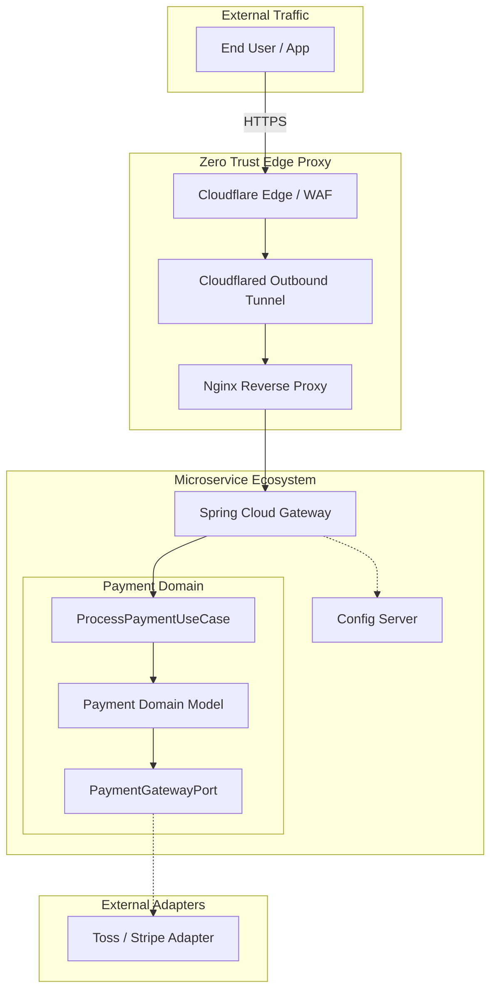

<div align="center">


<h3>🏟️ Cloud Native Infrastructure, Zero Trust Edge, and MSA Operations Lab</h3>

<p>
  
  
  
  
  
</p>

<p>
  
  
  
</p>

</div>

---

> MSA 운영 환경에서 보안, 배포, 구성 관리, 도메인 격리를 함께 다루는 Cloud Native 인프라 레퍼런스입니다.  
> Hexagonal Architecture, Zero Trust Edge, Terraform Day 0 provisioning, Ansible Day 1 operations를 하나의 운영 생태계로 통합합니다.

---

## 📌 Problem — 왜 만들었는가

- **MSA 운영 복잡도**: 서비스가 늘어날수록 라우팅, 설정, 배포, 장애 격리가 어려워집니다.
- **보안 경계 약화**: 외부 인바운드 포트 노출은 포트 스캐닝과 직접 공격면을 넓힙니다.
- **도메인 오염**: 인프라와 프레임워크 관심사가 비즈니스 로직에 침투하면 변경 비용이 커집니다.
- **수작업 운영 리스크**: 서버 설정과 배포가 사람의 기억에 의존하면 환경 편차와 장애 대응 비용이 커집니다.

Infra Master Lab은 MSA 인프라를 "실행 가능한 운영 표준"으로 정리합니다. 로컬 Docker Compose에서 시작해 IaC, Edge Proxy, Gateway, Kubernetes 운영 청사진까지 확장 가능한 구조를 제공합니다.

## 🏗️ Architecture — 어떻게 설계했는가



트래픽은 Cloudflare Edge와 outbound tunnel을 거쳐 내부 reverse proxy와 gateway에 도달합니다. 비즈니스 도메인은 외부 결제사, DB, 웹 프레임워크에 직접 의존하지 않고 port-adapter 경계로 격리됩니다.

## 📂 Project Structure

```text
infra-master-lab/
├── business-service/                          # 🏢 헥사고날 결제 도메인 서비스
│   ├── build.gradle                           # 🧰 Java 21 / Spring Boot 빌드 설정
│   ├── Dockerfile                             # 🐳 비즈니스 서비스 컨테이너 빌드
│   └── src/main/java/com/hooney/lab/business/payment/
│       ├── application/                       # 🚀 UseCase, InPort, Application Service
│       ├── domain/                            # 🧩 프레임워크 독립 순수 도메인 모델
│       └── framework/                         # 🔌 Web, DB, 외부 결제 Adapter
├── terraform/                                 # 🏗️ Day 0 인프라 프로비저닝
│   ├── environments/                          # 🌐 환경별 Terraform entrypoint
│   │   ├── local/                             # 🐳 Docker Provider 기반 로컬 Lab
│   │   └── aws-reference/                     # ☁️ AWS 운영 참조 구성
│   └── modules/                               # 📦 재사용 가능한 IaC 모듈
│       ├── network/                           # 🌐 네트워크 모듈
│       └── docker-service/                    # 🐳 컨테이너 서비스 모듈
├── ansible/                                   # 🔧 Day 1+ 서버 구성 관리
│   ├── roles/common/                          # 🛡️ OS 공통 보안/패키지/NTP 설정
│   ├── roles/docker/                          # 🐳 Docker 설치 및 daemon 구성
│   └── site.yml                               # 🚀 메인 운영 플레이북
├── infra/                                     # 🏗️ Edge 및 Service Mesh 구성
│   ├── edge-proxy/                            # 🛡️ Cloudflare Tunnel + Nginx Zero Trust Edge
│   └── service-mesh/                          # 🌐 Gateway, Config Server, 라우팅 계층
├── docs/                                      # 📚 ADR, 운영 가이드, 트러블슈팅
└── docker-compose.yml                         # 🐳 로컬 MSA 통합 실행 환경
```

## 🎯 Key Features & Evidence — 무엇을 증명하는가

### 1. Hexagonal Payment Domain

| Feature | Description |
| :--- | :--- |
| **Domain Isolation** | 결제 도메인을 외부 결제사, DB, 웹 프레임워크로부터 분리 |
| **Inbound Port** | 비즈니스 유스케이스를 명시적 인터페이스로 노출 |
| **Outbound Port** | Toss, Stripe 등 외부 결제사를 adapter로 교체 가능 |

**Evidence**

- [ADR-001: Hexagonal Architecture](./docs/decisions/ADR-001-hexagonal-architecture.md)
- 순수 Java 객체 기반 단위 테스트로 결제 승인/거절 상태 전이를 빠르게 검증합니다.

### 2. Zero Trust Edge Network

| Risk | Strategy | Evidence |
| :--- | :--- | :--- |
| 인바운드 포트 직접 노출 | Cloudflare Tunnel 기반 outbound 연결 | Edge proxy config |
| 원본 IP/보안 헤더 손실 | Nginx에서 IP 복원과 보안 헤더 주입 | `nginx.conf` |
| 직접 DDoS와 스캐닝 | Edge 계층에서 WAF와 터널로 차단 | ADR 문서 |

**Evidence**

- [ADR-002: Cloudflare 기반 Zero Trust](./docs/decisions/ADR-002-edge-security-cloudflare.md)
- 인바운드 포트를 직접 열지 않는 구조로 외부 노출면을 줄입니다.

### 3. Terraform + Ansible IaC Pipeline

| Phase | Tool | Responsibility |
| :--- | :--- | :--- |
| **Day 0** | Terraform | 네트워크, 컨테이너, 인프라 리소스 선언형 프로비저닝 |
| **Day 1+** | Ansible | OS 설정, 패키지 설치, 보안 설정, 운영 구성 관리 |
| **Drift Control** | Terraform State | 선언 상태와 실제 상태 차이 감지 |

**Evidence**

- [ADR-003: Terraform Docker Provider](./docs/decisions/ADR-003-terraform-docker-provider.md)
- [Terraform 사용 가이드](./terraform/README.md)
- Ansible role 구조로 반복 가능한 서버 구성 기준을 제공합니다.

### 4. Kubernetes Operations Blueprint

| Feature | Description |
| :--- | :--- |
| **Rolling Update** | 서비스 중단을 줄이는 배포 전략 |
| **Health Check** | readiness/liveness 기반 장애 감지 |
| **Gateway Routing** | 서비스 라우팅과 보안 정책의 중앙화 |

**Evidence**

- Kubernetes manifest와 Gateway 테스트를 통해 로컬 검증에서 운영 배포 흐름으로 확장할 수 있는 기준을 제공합니다.

## 🚀 Quick Start — 어떻게 실행하는가

### 로컬 통합 검증

```bash
git clone https://github.com/hooneyg/infra-master-lab.git
cd infra-master-lab

docker-compose up -d
```

### Traffic Scenario

- [Zero Trust 인그레스 및 헥사고날 결제 라우팅 시나리오](./docs/msa-scenarios.md)
- [실행 가능한 HTTP 스크립트](./examples/scenarios.http)

## 🧪 Tests — 어떻게 검증했는가

```bash
./gradlew test
```

| Layer | Test Target | What It Proves |
| :--- | :--- | :--- |
| Domain | Payment state transition | 외부 기술 없이 도메인 규칙 검증 |
| Gateway | Route and header policy | 라우팅 규칙과 보안 헤더 주입 |
| Config | Centralized configuration | 환경별 설정 분리와 암복호화 |
| IaC | Terraform/Ansible structure | 반복 가능한 운영 환경 구성 |

## 🧭 Roadmap

- [ ] Helm chart 구성
- [ ] Blue/Green 또는 Canary deployment 예제
- [ ] Observability stack 연동
- [ ] GitOps 배포 흐름
- [ ] Kubernetes health check와 rollout 검증 강화

## 🔗 Related Labs

| Related Lab | 연결 이유 |
| :--- | :--- |
| `security-auth-core` | API와 내부 호출의 인증/인가 기준 |
| `database-master-lab` | 상태 저장과 성능 최적화 기준 |
| `event-streaming-lab` | 비동기 이벤트와 장애 복구 기준 |
| `realtime-comm-lab` | 실시간 연결과 메시지 전달 기준 |
| `ai-agent-brain-lab` | 인프라 문서 기반 AI 운영 자동화 기준 |

## 📚 Documentation

- [Tech Wiki: Architecture Philosophy](./TECH_WIKI.md)
- [Terraform IaC Guide](./terraform/README.md)
- [Security Hardening Guide](./ansible/roles/common/tasks/main.yml)
- [Orchestration Blueprint](./k8s-manifests/business-service-deployment.yml)
- [Troubleshooting Guide](./docs/troubleshooting.md)

## 📄 License

This project is licensed under the [MIT License](./LICENSE).

---

<div align="center">
<b>Built by <a href="https://github.com/hooneyg">Hooney</a> — AI FullStack Developer & Enterprise Solution Architect</b>


</div>