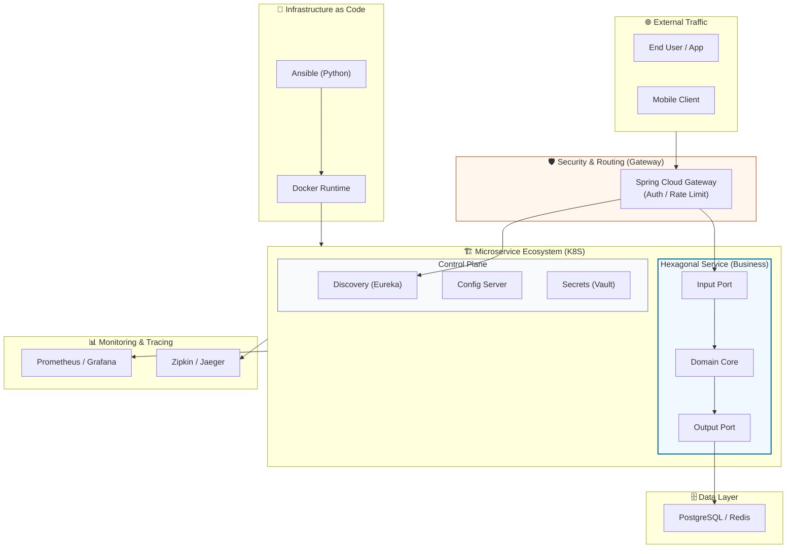

# 🏟️ Infra Master Lab: The Pinnacle of Cloud Native Architecture

<div align="center">
  
  <p><i>"Redefining Infrastructure as a Living Software Ecosystem"</i></p>

  [](https://spring.io/projects/spring-boot)
  [](https://openjdk.org/projects/jdk/21/)
  [](https://kubernetes.io/)
  [](https://www.ansible.com/)
</div>

---

## 🏗️ Project Essence
**Infra Master Lab**은 마이크로서비스 아키텍처(MSA)를 지탱하는 가장 견고하고 현대적인 인프라 표준을 제안합니다. 비즈니스 로직의 완벽한 격리를 실현하는 **Hexagonal Architecture**, 선언적 인프라 자동화를 구현하는 **Ansible**, 그리고 무중단 운영의 정수인 **Kubernetes**를 하나의 생태계로 통합했습니다.

---

## 🌐 MSA Blueprint & Ecosystem

Infra Master Lab이 지향하는 현대적 마이크로서비스 생태계의 전체 청사진입니다. 이 도식은 트래픽의 유입부터 비즈니스 실행, 그리고 이를 지탱하는 자동화 인프라의 유기적 관계를 보여줍니다.



### 🛰️ Ecosystem Highlights
- **Unified Gateway**: 모든 외부 요청은 보안이 강화된 단일 진입점(Gateway)을 통해 제어됩니다.
- **Hexagonal Core**: 비즈니스 로직은 도메인 중심으로 설계되어 인프라 변경에 영향받지 않습니다.
- **Automated Foundation**: Ansible과 Docker를 통해 서버 초기화부터 런타임 구성까지 선언적으로 관리합니다.
- **Full Observability**: 시스템의 모든 트래픽과 상태는 프로메테우스와 집킨을 통해 실시간으로 추적됩니다.

---

## ⚔️ Key Technological Pillars (Killing Verses)

### 💎 1. Hexagonal Isolation (DIP)
- 외부 기술(DB, API)이 바뀌어도 도메인은 흔들리지 않습니다.
- 어댑터 스위칭만으로 영속성 기술을 JPA에서 NoSQL로 즉시 교체 가능함을 증명합니다.

### 🐍 2. Pythonic Infrastructure (IaC)
- 사람이 손으로 하는 설정은 지양합니다.
- Ansible과 Python을 통해 서버 초기화부터 보안 하드닝까지 코드 한 방으로 끝냅니다.

### ☸️ 3. Cloud Native Resilience (K8S)
- 장애는 피할 수 없지만, 중단은 피할 수 있습니다.
- `Liveness/Readiness Probe`와 `Rolling Update`로 무중단 자가 치유 시스템을 구축했습니다.

---

## 🚀 Getting Started & Execution Plan

본 프로젝트는 인프라 구축부터 애플리케이션 운영까지 4단계의 체계적인 실행 전략을 지향합니다.

### 🏁 Phase 1: Build & Artifact Preparation
먼저 Java 소스 코드를 빌드하고 컨테이너 이미지를 생성합니다.
```bash
# 1. Gradle 빌드 (아티팩트 생성)
./gradlew clean build

# 2. Docker 이미지 빌드 (멀티 스테이지 최적화)
docker build -t hooney/infra-master-lab:latest .
```

### 🧪 Phase 2: Local Integration Verification (Docker Compose)
Kubernetes 배포 전, 로컬에서 전체 MSA 생태계의 정합성을 검증합니다.
```bash
# 로컬 통합 환경 기동 (Config + DB + Business + Gateway)
docker-compose up -d

# 서비스 상태 확인
docker-compose ps
```

### 🐍 Phase 3: Infrastructure Hardening (Ansible)
대상 서버에 보안 정책을 적용하고 컨테이너 런타임을 구축합니다.
```bash
# 인벤토리 확인 및 접속 테스트
ansible all -m ping -i ansible/inventory/hosts.ini

# 인프라 자동화 플레이북 실행
ansible-playbook -i ansible/inventory/hosts.ini ansible/site.yml
```

### ☸️ Phase 4: Cloud Native Deployment (Kubernetes)
최종적으로 고가용성이 보장되는 K8S 클러스터에 서비스를 런칭합니다.
```bash
# 매니페스트 적용 (Deployment & Service)
kubectl apply -f k8s-manifests/

# 롤링 업데이트 상태 모니터링
kubectl rollout status deployment/business-service
```

---

## 🛠️ Tech Stack Intentions
- **Java 21 / Spring Boot 4.0.6**: 최신 LTS 버전과 프레임워크로 성능과 안정성 확보.
- **Hexagonal Architecture**: 기술 부채를 도메인에서 격리하여 유지보수성 극대화.
- **Everything as Code (IaC)**: 인프라의 모든 변경 사항을 버전 관리 시스템(Git)으로 추적.

---

## 📚 Technical Deep Dive
- [📘 Tech Wiki: Architecture Philosophy](./TECH_WIKI.md)
- [🛡️ Security Hardening Guide (Ansible)](./ansible/roles/common/tasks/main.yml)
- [☸️ Orchestration Blueprint (K8S)](./k8s-manifests/business-service-deployment.yml)
- [🐳 Local Orchestration (Docker Compose)](./docker-compose.yml)

---
**Crafted with Professionalism by Hooney** 🚀  
*Copyright © 2026 Hooney. All rights reserved.*
