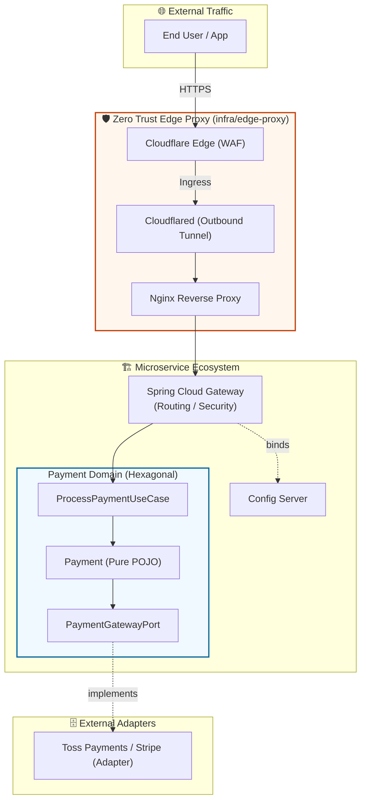

---
## 🏟️ Infra Master Lab: The Pinnacle of Cloud Native Architecture


<div align="center">
  
  <p><i>"Redefining Infrastructure as a Living Software Ecosystem"</i></p>

  [](https://spring.io/projects/spring-boot)
  [](https://openjdk.org/projects/jdk/21/)
  [](https://kubernetes.io/)
  [](https://www.ansible.com/)
  [](https://www.cloudflare.com/)
</div>

---

## 🏗️ 1. Project Essence (프로젝트 핵심 가치)
**Infra Master Lab**은 마이크로서비스 아키텍처(MSA)를 지탱하는 가장 견고하고 현대적인 인프라 표준을 제안합니다. 비즈니스 로직의 완벽한 격리를 실현하는 **Hexagonal Architecture(결제 도메인)**, 인바운드 포트를 전면 차단한 **Zero Trust Edge Network**, 그리고 무중단 운영의 정수인 **Kubernetes**를 하나의 생태계로 완벽하게 통합했습니다.

---

## 🌐 2. MSA Blueprint & Ecosystem (아키텍처 조감도)

이 도식은 외부 트래픽이 엣지 보안망을 뚫고 들어와 순수 결제 도메인 로직에 안전하게 닿는 전체 흐름을 보여줍니다.



---

## 📂 3. Project Structure

```text
infra-master-lab/
├── business-service/           # 🏢 헥사고날 아키텍처 기반 비즈니스 도메인 (Payment)
│   ├── build.gradle            # Spring Boot 4.0.6, Java 21
│   ├── Dockerfile
│   └── src/
│       ├── main/java/com/hooney/lab/business/payment/
│       │   ├── application/    # UseCase (InPort) & Service
│       │   ├── domain/         # 순수 POJO Domain
│       │   └── framework/      # Adapter (OutPort, Web, DB)
│       └── test/               # 아키텍처 및 도메인 격리 검증 단위 테스트
├── infra/
│   ├── edge-proxy/             # 🛡️ Zero Trust Nginx & Cloudflared 설정
│   └── service-mesh/           # 🕸️ Spring Cloud Gateway & Config Server
├── docs/                       # 📚 ADR(Architecture Decision Records) 문서
└── docker-compose.yml          # 인프라 전체 스택 원클릭 실행 (Scale-out 포함)
```

---

## ⚔️ 4. Key Technological Pillars (증거 기반 핵심 기술)

### ✅ 증거 1: Hexagonal Isolation (결제 도메인 완벽 격리)
기존 3-Layered 구조의 한계를 벗어나, 외부 기술(Toss, Stripe)이 바뀌어도 도메인은 단 한 줄도 흔들리지 않습니다.
- **[ADR-001: Hexagonal Architecture 채택 결정문](./docs/decisions/ADR-001-hexagonal-architecture.md)**
- 순수 자바 객체만으로 0.01초 만에 비즈니스 로직을 검증하는 [단위 테스트 코드](./business-service/src/test/java/com/hooney/lab/business/payment/application/service/PaymentServiceTest.java) 구현 완료.

### ✅ 증거 2: Zero Trust Network (Cloudflare Tunnel)
서버의 인바운드 포트를 모두 차단(`ports: "80:80"` 제거)하여 포트 스캐닝 및 직접적인 DDoS 공격을 원천 차단했습니다.
- **[ADR-002: Cloudflare 기반 Zero Trust 채택 결정문](./docs/decisions/ADR-002-edge-security-cloudflare.md)**
- Cloudflare IP 복원 및 보안 헤더가 주입된 [엔터프라이즈 Nginx 설정](./infra/edge-proxy/nginx.conf).

### ✅ 증거 3: Pythonic Infrastructure (IaC) & K8s
사람이 손으로 직접 타이핑하는 서버 설정은 지양합니다. Ansible과 K8s 매니페스트를 통한 `Rolling Update`로 무중단 배포 시스템을 구축했습니다.

---

## 🚀 5. Quick Start & Traffic Scenarios (실행 및 시나리오)

백문이 불여일견입니다. **IntelliJ 또는 VSCode REST Client**에서 즉시 실행 가능한 시나리오 스크립트를 제공합니다.

- 📖 **[Zero Trust 인그레스 및 헥사고날 결제 라우팅 시나리오 읽어보기](./docs/msa-scenarios.md)**
- 🚀 **[실행 가능한 HTTP 스크립트 열기 (`scenarios.http`)](./examples/scenarios.http)** 

### 로컬 통합 검증 (Docker Compose)
Kubernetes 배포 전, 로컬에서 전체 MSA 생태계의 정합성을 원클릭으로 검증합니다.
```bash
# 엣지 프록시 및 백엔드 서비스 백그라운드 구동
docker-compose up -d
```

---

## 🧪 6. Tests — 어떻게 검증했는가

```bash
./gradlew test
```
- **Domain Layer (Hexagonal)**: 외부 DB나 무거운 스프링 컨텍스트 로딩 없이, 순수 결제 도메인의 승인/거절 상태 전이 완벽 검증.
- **Gateway Layer**: `WebTestClient`를 활용한 `/api/payment/**` 라우팅 규칙 및 보안 헤더(`X-Frame-Options` 등) 주입 검증.
- **Config Layer**: 중앙 집중형 설정값의 암복호화 및 프로파일 분리 검증.

---

## 📚 7. Technical Deep Dive (기술 문서 딥다이브)
- [📘 Tech Wiki: Architecture Philosophy](./TECH_WIKI.md)
- [🛡️ Security Hardening Guide (Ansible)](./ansible/roles/common/tasks/main.yml)
- [☸️ Orchestration Blueprint (K8S)](./k8s-manifests/business-service-deployment.yml)

---
**Crafted with Professionalism by Hooney** 🚀  
*Copyright © 2026 Hooney. All rights reserved.*


