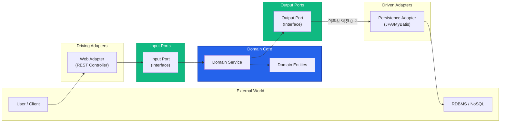
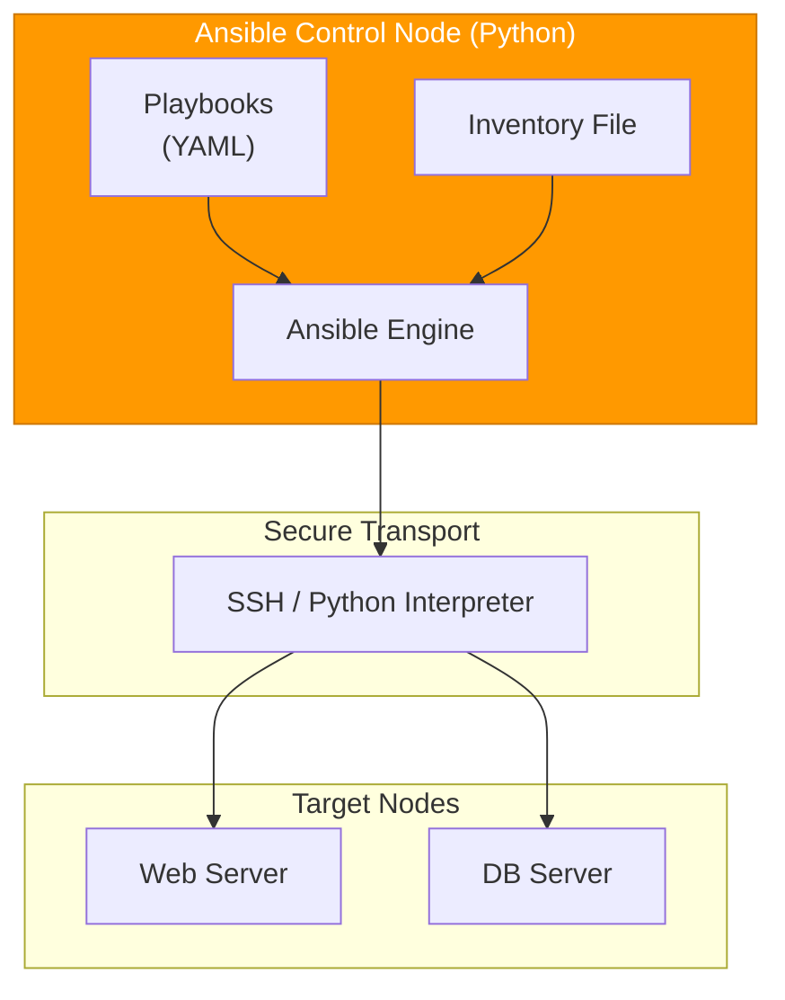
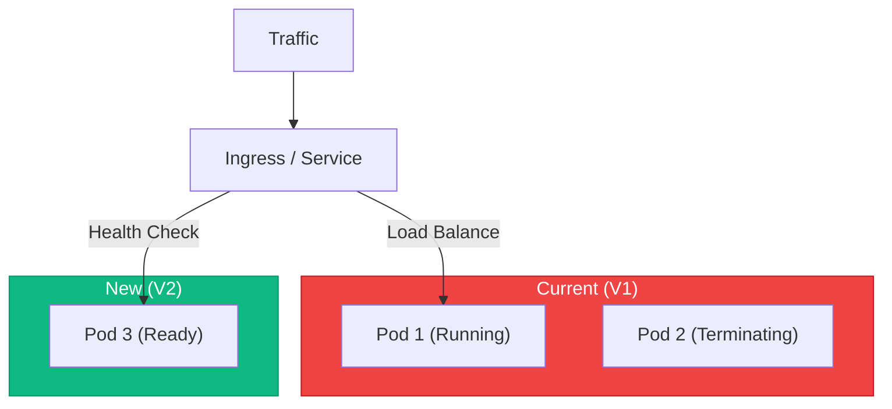

# 📚 Tech Wiki: The Philosophy of Infra Master Lab

> **"Infrastructure is no longer hardware; it is defined as Software."**  
> 본 프로젝트에 녹여낸 아키텍처 철학과 클라우드 네이티브 운영 전략을 상세히 기록합니다.

---

## 🏗️ 1. Hexagonal Architecture: The Sanctuary of Business Logic

비즈니스 로직은 외부 기술의 변화(DB 교체, 프레임워크 변경 등)로부터 완전히 보호받아야 합니다.

### 🧩 아키텍처 도식

### 📘 핵심 원리: 의존성 역전 (DIP)
- **성역화**: 도메인 계층은 외부 라이브러리 의존성 0%를 유지합니다.
- **Port**: 도메인이 외부와 소통하기 위해 정의한 **'계약'**입니다.
- **Adapter**: 특정 기술(JPA, REST 등)을 사용하여 포트를 실제로 구현한 **'플러그인'**입니다.

---

## 🐍 2. Ansible: Python-based Infrastructure as Code

수동 설정에 의한 '눈송이 서버(Snowflake Server)' 현상을 방지하고, 모든 인프라를 코드로 관리합니다.

### ⚙️ 자동화 흐름

---

## ☸️ 3. Kubernetes: Resilience & Zero-Downtime

클라우드 네이티브 인프라의 핵심은 **'가용성'**과 **'자가 치유'**입니다.

### 🔄 무중단 배포 매커니즘 (Rolling Update)

- **Self-Healing**: Pod 장애 시 K8S 컨트롤러가 자동으로 새 인스턴스를 생성하여 가용성을 복구합니다.
- **HPA**: CPU/Memory 부하에 따라 수초 내에 인프라를 자동 확장(Scale-out)합니다.

---
**Designed by Hooney (AI Architect)** 🚀
