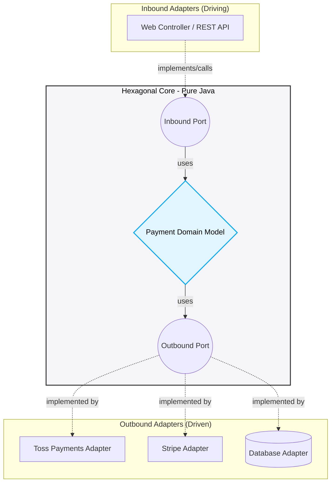

# ADR-001: Hexagonal Architecture (Ports and Adapters) 채택

## 1. 배경 (Context)
`business-service`는 결제 처리(Payment)라는 핵심 도메인을 담당합니다. 기존의 3-Layered Architecture(Controller -> Service -> Repository)는 데이터베이스나 외부 API(PG사)에 강하게 결합되는 문제가 있었습니다. 결제 모듈이 Toss Payments에서 Stripe로 변경되거나, DB가 MySQL에서 MongoDB로 변경될 때 비즈니스 로직(Service)까지 수정해야 하는 위험이 존재했습니다.

## 2. 대안 (Alternatives)
1. **3-Layered Architecture**: 구현이 빠르고 직관적이지만, 도메인이 인프라에 종속됨.
2. **Hexagonal Architecture (Ports and Adapters)**: 순수 도메인을 중앙에 두고, 모든 외부 입출력을 Port(인터페이스)와 Adapter(구현체)로 분리하여 의존성 역전(DIP)을 강제함.
3. **Clean Architecture**: 헥사고날과 유사하나 계층이 더 세분화되어 있어 현재 마이크로서비스 규모 대비 오버엔지니어링 우려.

## 3. 결정 (Decision)
**Hexagonal Architecture**를 채택합니다.
- 결제 코어 로직은 `domain` 패키지에 순수 Java(POJO)로 작성하여 프레임워크나 외부 라이브러리 의존성을 0으로 만듭니다.
- PG사 연동 로직은 `port.out.PaymentPort` 인터페이스를 통해 호출하며, 실제 통신은 `adapter.out.pg.TossPaymentsAdapter`에서 처리합니다.

## 4. 결과 (Consequences)
- **장점**: 결제 PG사가 변경되어도 도메인 로직은 단 한 줄도 수정할 필요가 없습니다. 외부 의존성(DB, 외부 API) 없이 도메인 로직만 단위 테스트가 가능해져 테스트 속도와 신뢰성이 극대화됩니다.
- **단점**: 인터페이스(Port)와 DTO 맵핑 코드가 늘어나 초기 구현 비용이 다소 증가합니다.

## 5. 아키텍처 다이어그램 (Architecture Diagram)

