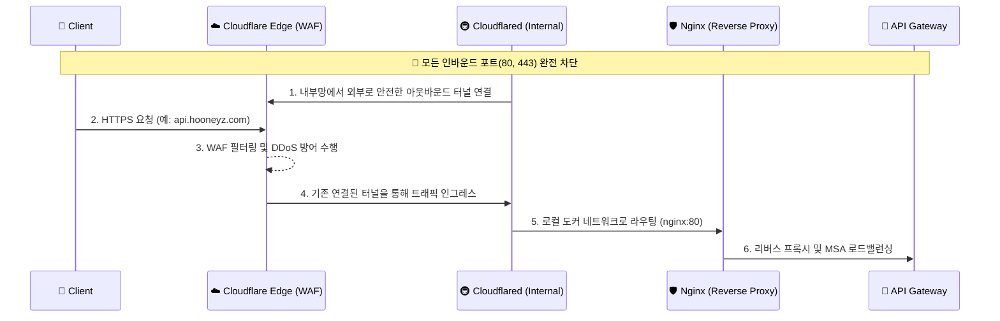

# ADR-002: Cloudflare Tunnel 기반 Zero Trust 엣지 라우팅 채택

## 1. 배경 (Context)
마이크로서비스 아키텍처(MSA)를 클라우드에 배포할 때, 내부 API Gateway나 인프라 서버를 Public IP로 직접 노출하면 DDoS 공격이나 포트 스캐닝의 대상이 됩니다. 전통적인 방식(AWS ALB + WAF)은 설정이 복잡하고 유지보수 비용이 큽니다.

## 2. 대안 (Alternatives)
1. **Public IP 직접 노출 (Nginx)**: 구성이 가장 쉽지만 보안이 취약함.
2. **AWS/GCP Native WAF & LoadBalancer**: 엔터프라이즈 환경에서 표준이지만, 클라우드 벤더 종속성(Lock-in)이 생기고 테스트 비용이 발생함.
3. **Cloudflare Tunnel (Zero Trust)**: 서버의 인바운드 포트를 모두 차단하고, 서버가 Cloudflare 엣지로 아웃바운드 터널을 연결하여 안전하게 트래픽을 인그레스 시킴.

## 3. 결정 (Decision)
**Cloudflare Tunnel + Nginx (Edge Proxy)** 아키텍처를 채택합니다.
- `infra/edge-proxy` 구성을 통해, 외부 인터넷에서 직접 서버로 들어오는 인바운드 연결은 원천 차단합니다.
- 오직 Cloudflare를 거쳐 필터링된 트래픽만 `cloudflared` 데몬을 통해 Nginx 리버스 프록시로 전달되고, 이후 내부 API Gateway로 라우팅됩니다.

## 4. 결과 (Consequences)
- **장점**: 서버에 공인 IP나 오픈된 인바운드 포트가 전혀 필요하지 않아 방화벽 룰 관리가 극단적으로 단순화됩니다. DDoS 방어와 무료 SSL 인증서를 엣지 단에서 자동으로 해결합니다.
- **단점**: 전체 트래픽이 Cloudflare 망을 거치므로 약간의 네트워크 홉(Hop) 레이턴시가 추가될 수 있습니다.

## 5. 아키텍처 다이어그램 (Zero Trust Ingress Flow)

