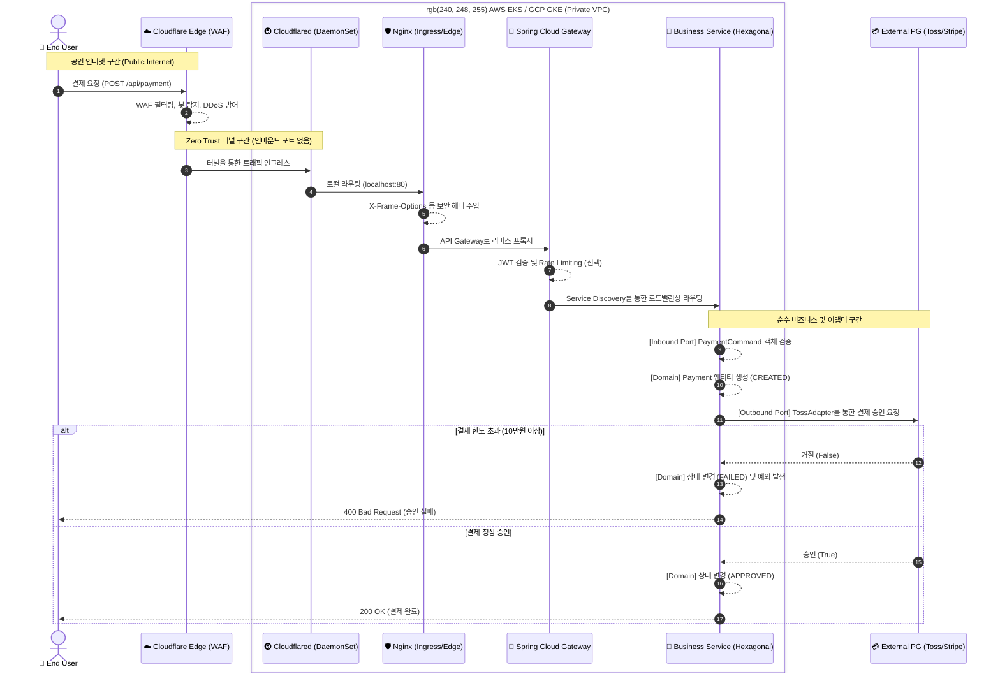

# 🛡️ MSA 및 Zero Trust 네트워크 트래픽 시나리오 (Traffic Scenarios)

이 문서는 `infra-master-lab`의 핵심인 **"트래픽이 외부망에서 어떻게 엣지를 통과하여 MSA 내부 깊숙한 도메인 로직까지 안전하게 도달하는가?"**를 증명하는 종합 시나리오입니다.

단순히 프록시를 거치는 수준을 넘어, **Cloudflare 엣지 방어망**, **Kubernetes(AWS EKS / GCP GKE)** 클러스터 라우팅, 그리고 **Hexagonal Architecture** 기반의 비즈니스 격리까지 엔터프라이즈 수준의 완벽한 흐름을 보여줍니다.

---

## 🏛️ 엔터프라이즈 아키텍처 다이어그램 (End-to-End Flow)

마이크로서비스 아키텍처(MSA)는 단순한 분산 시스템이 아닙니다. 아래 다이어그램은 글로벌 트래픽이 클라우드 벤더(AWS/GCP)의 퍼블릭 망을 거쳐 사설 서브넷(Private Subnet)의 순수 비즈니스 로직에 닿기까지의 모든 여정을 보여줍니다.

---

## ☁️ 클라우드 애그노스틱 (AWS EKS & GCP GKE) 배포 전략

이 아키텍처는 특정 퍼블릭 클라우드 벤더에 종속되지 않는 **Cloud-Agnostic(클라우드 독립적)** 인프라를 지향합니다.

### 1. AWS EKS (Elastic Kubernetes Service) 아키텍처
- **Private Subnet 격리**: 모든 워커 노드는 퍼블릭 IP가 없는 Private Subnet에 배치됩니다.
- **ALB 배제**: 전통적으로 AWS에서는 ALB(Application Load Balancer)를 생성하여 외부망에 노출하지만, 본 프로젝트는 Cloudflare Tunnel을 사용하므로 비싼 ALB 유지 비용과 복잡한 AWS WAF 룰셋을 완벽히 걷어낼 수 있습니다.
- **보안 이점**: 해커가 AWS VPC의 대역폭을 알아내더라도, 인바운드 포트가 없으므로 침투가 불가능합니다.

### 2. GCP GKE (Google Kubernetes Engine) 아키텍처
- **VPC Native Cluster**: Google의 프리미엄 글로벌 네트워크를 활용하며, `cloudflared` 데몬을 통해 Cloudflare 엣지와 가장 짧은 레이턴시로 터널을 형성합니다.
- **Cloud NAT**: `cloudflared`가 외부로 아웃바운드 연결을 맺기 위해 오직 Cloud NAT만을 활용하며, 외부 인그레스(Ingress) 리소스 생성 없이도 안전한 통신이 보장됩니다.

---

## 🎭 상세 트래픽 시나리오 (실행 가능)

모든 시나리오는 IDE(IntelliJ, VSCode)에서 `examples/scenarios.http` 파일을 통해 클릭 한 번으로 시뮬레이션해 볼 수 있습니다.

### 시나리오 1: Zero Trust 기반 엣지 프록싱 (Edge Proxying)
- **상황**: 해커가 K8s 클러스터 내부에 구동 중인 결제 서비스에 직접 접근하려 합니다.
- **방어**: 서버의 퍼블릭 인바운드 포트는 완전히 닫혀 있습니다. 
- **결과**: 오직 Cloudflare 엣지를 통과한 트래픽만이 `cloudflared` 데몬을 거쳐 내부 Nginx로 인입될 수 있습니다. `curl`로 서버 공인 IP를 직접 찌르면 즉시 연결이 거부(Connection Refused)됩니다.

### 시나리오 2: 헥사고날 도메인 격리와 상태 전이
- **상황**: 안전하게 API Gateway를 통과한 요청이 `business-service`로 라우팅됩니다.
- **흐름**: 
  1. `Gateway` -> `Web Adapter` -> `Application Service`로 진입.
  2. 비즈니스 로직은 순수 자바(POJO) 도메인인 `Payment` 객체를 생성(CREATED)합니다.
  3. `PaymentGatewayPort`를 호출하면, 주입된 `TossPaymentsAdapter`가 외부 API를 모의 호출합니다.
  4. 10만 원 이하 결제는 **승인(APPROVED)**, 초과 결제는 **거절(FAILED)**로 도메인 스스로 상태를 전이시킵니다.
- **검증**: `examples/scenarios.http`를 실행하면 즉시 응답을 확인할 수 있습니다. 만약 PG사를 Toss에서 Stripe로 바꾸고 싶다면, 도메인 로직은 단 한 줄도 고칠 필요 없이 `StripeAdapter`만 새로 추가하면 됩니다!
